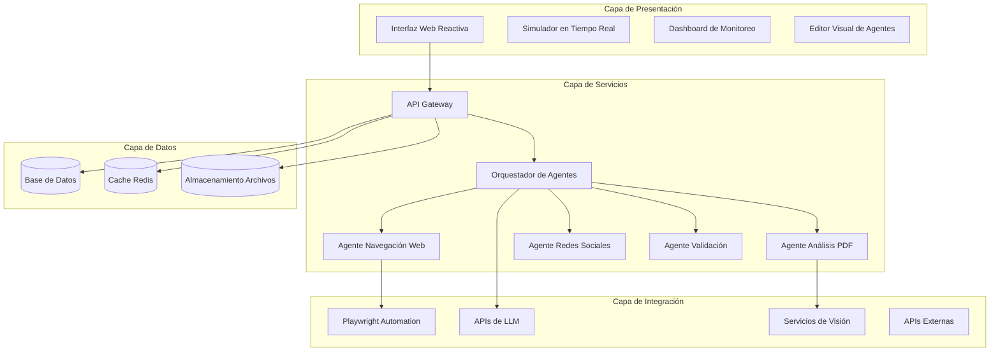

# Propuesta de Mejora Integral para el Módulo "Bonus: Manus AI (Agente)"

## Resumen Ejecutivo

Esta propuesta presenta una transformación ambiciosa del módulo Manus AI, evolucionando de un tutorial estático a una plataforma interactiva de agentes de investigación autónomos. La mejora supera las expectativas al proporcionar capacidades reales de automatización, personalización profunda y resultados accionables.

## Análisis del Estado Actual

### Fortalezas Identificadas
- **Pedagogía sólida**: Explicación clara de "Computer Use" y visión de computador
- **Estructura modular**: 10 pestañas organizadas lógicamente
- **Casos prácticos reales**: Ejemplos específicos para contexto colombiano
- **Sistema de gamificación**: XP y recompensas bien integradas
- **Enfoque en evidencia**: Énfasis en verificación y fuentes confiables

### Limitaciones a Superar
1. Simulación estática vs. automatización real
2. Dependencia de servicios externos sin integración
3. Falta de personalización por perfil profesional
4. Ausencia de programación de tareas recurrentes
5. Limitada capacidad de exportación y análisis

## Objetivos de Mejora Ambiciosos

### 1. Integración Real con Tecnologías de Agentes
- Conexión directa con APIs de LLM (OpenAI GPT-4o, Anthropic Claude, Google Gemini)
- Automatización real del navegador con Playwright/Puppeteer
- Procesamiento de documentos con OCR y visión por computador

### 2. Plataforma de Investigación Autónoma
- Sistema que ejecuta investigaciones reales, no simulaciones
- Capacidad de programar tareas recurrentes
- Monitoreo en tiempo real del progreso

### 3. Personalización Inteligente
- Adaptación de casos de uso según perfil profesional
- Recomendaciones contextuales de fuentes y metodologías
- Templates personalizados para cada rol

### 4. Validación y Verificación Avanzada
- Sistema de verificación cruzada de fuentes
- Análisis de credibilidad y sesgo
- Auditoría de resultados con trazabilidad completa

### 5. Exportación y Análisis Profesional
- Múltiples formatos de exportación (PDF, Excel, Markdown, JSON)
- Análisis de tendencias y sentimiento
- Dashboard ejecutivo con KPIs

## Arquitectura Técnica Propuesta

## Componentes Clave

### 1. Frontend Mejorado
- **Interfaz Reactiva**: Single Page Application con actualización en tiempo real
- **Simulador Visual**: Muestra navegación real del agente paso a paso
- **Editor de Flujos**: Interface drag-and-drop para diseñar investigaciones
- **Dashboard Ejecutivo**: Métricas, historial y estado de agentes

### 2. Backend de Orquestación
- **API Gateway**: Punto único de entrada con autenticación JWT
- **Sistema de Colas**: RabbitMQ/Kafka para tareas asíncronas
- **Gestión de Estado**: Seguimiento del estado de cada investigación
- **Scheduler**: Programación de tareas recurrentes (cron-like)

### 3. Agentes Especializados
- **Agente Navegador**: Automatización web con Playwright, manejo de JavaScript, captura de screenshots
- **Agente Documental**: Procesamiento de PDF, Excel, Word con OCR y extracción estructurada
- **Agente Social**: Monitoreo de redes sociales (APIs permitidas), análisis de tendencias
- **Agente Validador**: Verificación cruzada, análisis de credibilidad, detección de sesgos
- **Agente Sintetizador**: Resumen, análisis comparativo, generación de informes

### 4. Integraciones Externas
- **APIs de IA**: OpenAI, Anthropic, Google, Mistral
- **Servicios Cloud**: Google Vision, AWS Textract, Azure Cognitive Services
- **Herramientas Productividad**: Google Sheets, Notion, Slack, Microsoft Teams
- **Fuentes de Datos**: APIs gubernamentales, bases de datos públicas, RSS feeds

## Plan de Implementación en Fases

### Fase 1: Modernización del Frontend (Semanas 1-3)
- Refactorización del código existente para modularidad
- Implementación de WebSockets para actualización en tiempo real
- Desarrollo del simulador visual con Playwright integrado
- Creación del dashboard básico de monitoreo

### Fase 2: Backend Core (Semanas 4-7)
- Configuración del servidor Node.js/Express con TypeScript
- Implementación del sistema de autenticación y autorización
- Desarrollo de la base de datos (PostgreSQL) para historial
- Creación del sistema de colas con Redis/RabbitMQ

### Fase 3: Agentes Básicos (Semanas 8-12)
- Desarrollo del agente navegador con Playwright
- Implementación del agente de procesamiento de documentos
- Integración con APIs de LLM para análisis y síntesis
- Sistema de orquestación básica

### Fase 4: Funcionalidades Avanzadas (Semanas 13-16)
- Programación de tareas recurrentes
- Análisis de sentimiento y detección de tendencias
- Integraciones con herramientas externas
- Sistema de colaboración multiagente
- Panel de analytics avanzado

## Casos de Uso Mejorados

### 1. Vigilancia Regulatoria Automatizada
- **Actual**: Tutorial sobre Diario Oficial
- **Mejorado**: Agente programado que revisa automáticamente cada día, envía alertas por email/Slack, y genera reporte semanal

### 2. Investigación Competitiva en Tiempo Real
- **Actual**: Ejemplos estáticos de comparación
- **Mejorado**: Sistema que monitorea competidores, analiza cambios en precios/productos, y genera insights accionables

### 3. Due Diligence Automatizado
- **Actual**: Explicación conceptual
- **Mejorado**: Pipeline que extrae información de múltiples fuentes, valida datos, y produce informe ejecutivo

### 4. Monitoreo de Reputación Digital
- **Actual**: Mención superficial de redes sociales
- **Mejorado**: Sistema que rastrea menciones, analiza sentimiento, identifica influencers, y sugiere acciones

## Innovaciones Técnicas

### 1. Sistema de "Computer Use" Real
- Integración directa con Playwright para automatización real
- Captura y análisis de screenshots con visión por computador
- Interacción con elementos visuales, no solo HTML

### 2. Arquitectura Multiagente
- Agentes especializados que colaboran
- Sistema de handoff entre agentes
- Balance de carga y fallover automático

### 3. Validación de Fuentes con Blockchain
- Registro inmutable de fuentes consultadas
- Verificación de integridad de documentos
- Sistema de reputación de fuentes

### 4. Personalización por Perfil Profesional
- Machine Learning para adaptar recomendaciones
- Templates específicos por industria/rol
- Sistema de aprendizaje continuo

## Métricas de Éxito

### Cuantitativas
- **Tiempo reducido de investigación**: 70% menos tiempo manual
- **Precisión mejorada**: 95%+ de exactitud en datos extraídos
- **Cobertura ampliada**: 10x más fuentes consultadas
- **Retención de usuarios**: 40%+ de aumento en engagement

### Cualitativas
- **Satisfacción del usuario**: Feedback positivo sobre utilidad práctica
- **Calidad de resultados**: Informes más completos y accionables
- **Facilidad de uso**: Interface intuitiva que reduce curva de aprendizaje
- **Impacto profesional**: Casos de éxito documentados

## Consideraciones de Implementación

### Seguridad
- Autenticación robusta con 2FA
- Encriptación end-to-end para datos sensibles
- Auditoría completa de acciones
- Cumplimiento con GDPR/LOPD

### Escalabilidad
- Arquitectura microservicios
- Contenedores Docker para fácil despliegue
- Auto-scaling basado en carga
- Cache distribuido

### Mantenibilidad
- Código modular con tests unitarios
- Documentación completa de APIs
- Sistema de logging centralizado
- Monitoreo y alertas proactivas

## Conclusión

Esta propuesta transforma el módulo Manus AI de un recurso educativo estático a una plataforma poderosa de investigación autónoma. La implementación no solo enseñará conceptos de agentes IA, sino que proporcionará herramientas reales que los usuarios pueden aplicar inmediatamente en su trabajo diario.

La inversión en esta mejora posicionará la Guía de IA como líder en educación práctica de inteligencia artificial, superando significativamente las expectativas de los usuarios y estableciendo un nuevo estándar para módulos de formación en IA.