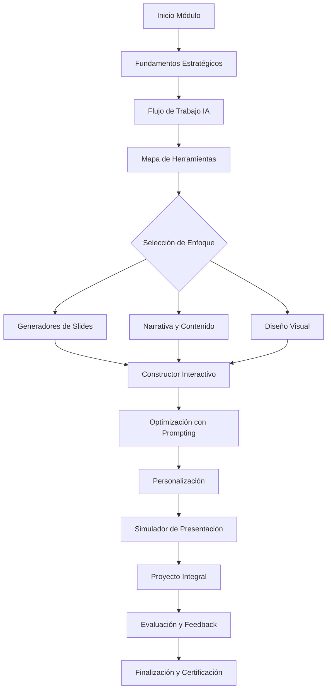

# Arquitectura del Módulo Bonus: IA para Presentaciones de Alto Impacto

## Visión General
Módulo bonus avanzado que enseña la integración estratégica de herramientas de IA en todo el ciclo de creación de presentaciones, dirigido a profesionales que buscan dominar la creación de presentaciones de alto impacto.

## 5 Pilares Fundamentales (Basados en los requerimientos)

1. **Fundamentos Estratégicos**
   - Marco conceptual: cómo la IA transforma narrativa, diseño y entrega
   - Diferenciación entre automatización básica y potenciación creativa estratégica
   - Ética en el uso de IA y selección crítica de herramientas

2. **Flujo de Trabajo Integrado con IA**
   - Proceso paso a paso desde ideación hasta ensayo
   - Integración de herramientas específicas para cada fase
   - Mapeo de herramientas por etapa del ciclo de presentación

3. **Maestría en Herramientas Específicas**
   - Tutoriales aplicados y comparativas de herramientas líderes
   - Casos de uso prácticos, ventajas y limitaciones
   - Herramientas por categoría: diapositivas, narrativa, diseño, avatares y voz

4. **Optimización y Personalización**
   - Técnicas de prompting avanzado para presentaciones
   - Edición iterativa y refinamiento de resultados
   - Integración de datos y branding corporativo

5. **Presentación y Entrega Asistida por IA**
   - Coaches de IA para ensayar (Yoodli, Poised)
   - Análisis de lenguaje no verbal
   - Materiales complementarios interactivos

## Estructura del Módulo (Formato Bonus)

### Encabezado Premium
- Badge: "BONUS: PRESENTACIONES PRO"
- Título: "🎬 Presentaciones Pro: IA para Presentaciones de Alto Impacto"
- Descripción: Aprende el arte de crear presentaciones que enamoran usando IA estratégica
- Metadatos: ⏱️ 60 min · 💎 200 XP · 🏆 Insignia: Director de Presentaciones

### Mapa Mental del Módulo
- Concepto central: "La IA no solo crea diapositivas; diseña experiencias persuasivas"
- Chips de enfoque: Narrativa estratégica, Diseño automático, Coaching de entrega, Personalización, Flujo integrado

### Sistema de Pestañas (15-18 pestañas como módulos avanzados)

**Núcleo Conceptual:**
1. 🧠 **Fundamentos Estratégicos** - Marco conceptual y ética
2. 🛤️ **Flujo de Trabajo IA** - Proceso paso a paso integrado
3. 🧰 **Mapa de Herramientas** - Panorama completo por categoría

**Herramientas Específicas:**
4. ⚡ **Generadores de Slides** - Gamma, Beautiful.AI, DeckRobot
5. 📝 **Narrativa y Contenido** - ChatGPT, Claude, Gemini
6. 🎨 **Diseño Visual** - DALL-E, Midjourney, Canva AI
7. 🎭 **Avatares y Voz** - Synthesia, HeyGen, ElevenLabs
8. 🎯 **Coaches de Presentación** - Yoodli, Poised, Orai

**Componentes Interactivos:**
9. 🏗️ **Constructor de Estructura** - Generador de narrativa
10. 🎨 **Diseñador de Slides** - Visualizador de estilos
11. 🎤 **Simulador de Presentación** - Práctica con feedback
12. 📊 **Evaluador de Calidad** - Análisis de presentaciones

**Optimización:**
13. 🧠 **Prompting Avanzado** - Técnicas específicas para presentaciones
14. 🎯 **Personalización** - Integración de branding y datos
15. 🔄 **Iteración y Refinamiento** - Flujo de mejora continua

**Proyecto Final:**
16. 🏆 **Proyecto Integral** - Creación completa de presentación
17. 📋 **Criterios de Evaluación** - Rúbrica de calidad
18. 🚀 **Estrategia Real** - Aplicación en contextos profesionales

## Componentes Interactivos Clave

### 1. Constructor de Flujo de Trabajo
- Interfaz visual para diseñar el proceso de creación
- Selección de herramientas por etapa
- Generación de checklist personalizado

### 2. Comparador de Herramientas
- Tabla interactiva con filtros por categoría, costo, complejidad
- Casos de uso específicos para cada herramienta
- Recomendaciones basadas en contexto del usuario

### 3. Generador de Prompts Especializados
- Templates para diferentes tipos de presentaciones
- Ajuste de parámetros: audiencia, duración, objetivo
- Exportación a herramientas específicas

### 4. Simulador de Presentación
- Grabación de voz con análisis de tono, ritmo, pausas
- Feedback automático sobre claridad, persuasión, estructura
- Sugerencias de mejora basadas en IA

### 5. Evaluador de Calidad
- Carga o descripción de presentación
- Análisis según criterios: claridad, innovación IA, diseño, narrativa
- Puntuación y recomendaciones de mejora

## Integración con Sistema Existente

### Gamificación
- XP por completar secciones: 200 XP total
- Insignia: "Director de Presentaciones"
- Logros desbloqueables: "Narrativa Maestra", "Diseñor Pro", "Orador IA"

### Progreso
- Sistema de checkpoints por pilar completado
- Barra de progreso visual
- Certificado de finalización

### Navegación
- Integración con menú principal de módulos IA
- Navegación entre pestañas con estado persistente
- Botones de siguiente/anterior entre módulos

## Tecnología y Implementación

### Estructura de Archivos
- `src/modules/ia/module-presentaciones-pro.js` (nuevo archivo)
- Actualización de `src/modules/ia/index.js` para incluir nuevo módulo
- Estilos adicionales en `src/css/modules.css`

### Componentes Reutilizables
- Sistema de pestañas existente (`ag-tabs`)
- Tarjetas de contenido (`section-card`, `glass-card-ultra`)
- Elementos interactivos (`gl-btn`, `premium-textarea`)
- Sistema de toast y notificaciones

### Integración con Backend
- Guardado de progreso en `src/data/modules/ia/`
- Sistema de XP a través de `window.app.addXP()`
- Tracking de completitud de módulo

## Flujo de Usuario

## Criterios de Éxito
- **Completitud**: Cubre los 5 pilares fundamentales
- **Interactividad**: Mínimo 5 componentes interactivos clave
- **Profundidad**: Tutoriales aplicados para cada herramienta principal
- **Integración**: Flujo coherente entre todas las secciones
- **Aplicabilidad**: Proyecto final que aplica todos los conceptos

## Próximos Pasos
1. Crear plan de contenido detallado por pilar
2. Diseñar wireframes de componentes interactivos
3. Definir contenido específico para cada herramienta
4. Crear templates de prompts especializados
5. Diseñar sistema de evaluación del proyecto final