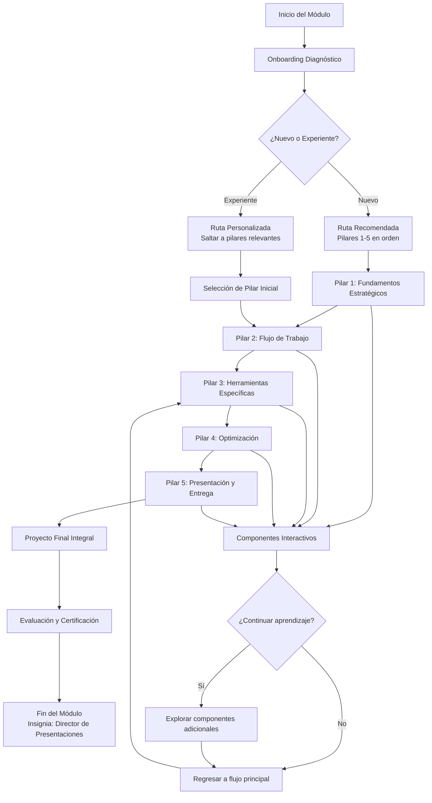
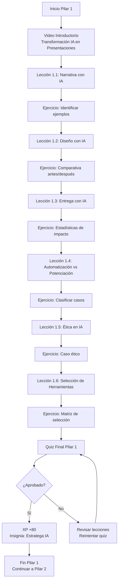
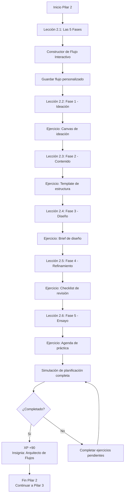
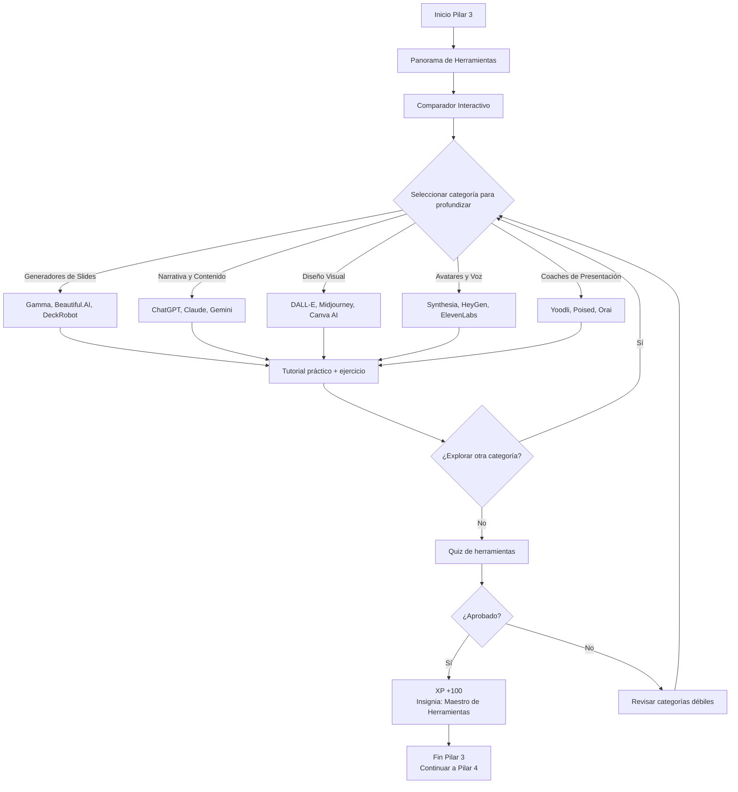
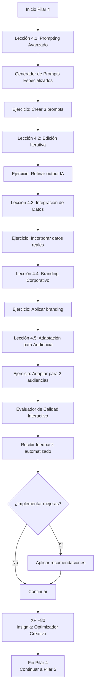
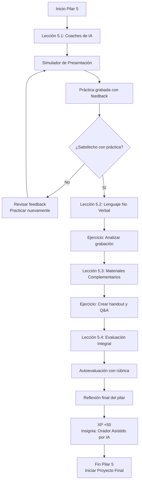
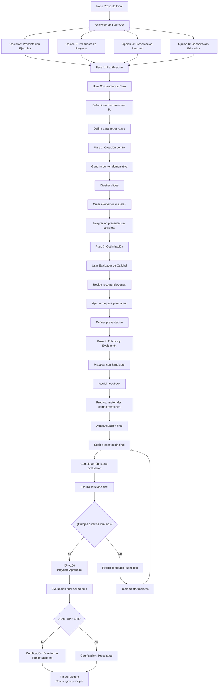
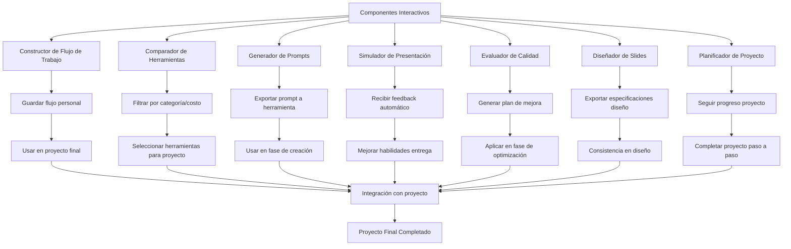
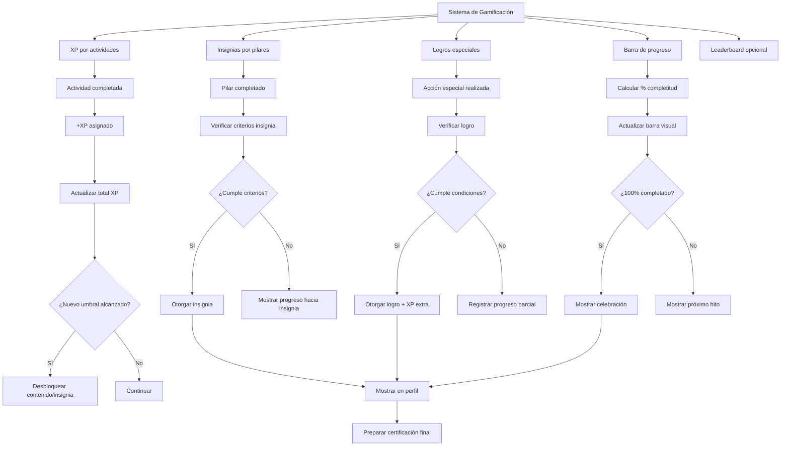

# Diagrama de Flujo del Módulo
## Módulo Bonus: IA para Presentaciones de Alto Impacto

---

## Diagrama de Flujo Principal



---

## Flujo Detallado por Pilar

### Pilar 1: Fundamentos Estratégicos



### Pilar 2: Flujo de Trabajo Integrado



### Pilar 3: Maestría en Herramientas



### Pilar 4: Optimización y Personalización



### Pilar 5: Presentación y Entrega



---

## Flujo del Proyecto Final Integral



---

## Flujo de Componentes Interactivos



---

## Flujo de Gamificación y Progreso



---

## Decision Points y Rutas Alternativas

### Punto de Decisión 1: Experiencia Previa
```
Usuario llega al módulo
│
├──¿Experiencia previa con IA para presentaciones?
│  │
│  ├── Sí → Ruta Acelerada
│  │     ├── Quiz de diagnóstico
│  │     ├── Saltar a pilares con menor puntuación
│  │     └── Enfocarse en componentes avanzados
│  │
│  └── No → Ruta Completa
│        ├── Seguir pilares 1-5 en orden
│        ├── Énfasis en fundamentos
│        └── Tutoriales paso a paso
```

### Punto de Decisión 2: Objetivos de Aprendizaje
```
Usuario define objetivos
│
├──¿Qué quiere lograr?
│  │
│  ├── Crear presentaciones más rápido → Enfasis en Pilar 2-3
│  │
│  ├── Mejorar calidad diseño → Enfasis en Pilar 3-4
│  │
│  ├── Mejorar habilidades de entrega → Enfasis en Pilar 5
│  │
│  └── Entender marco estratégico → Enfasis en Pilar 1
```

### Punto de Decisión 3: Herramientas Disponibles
```
Usuario selecciona herramientas
│
├──¿Qué herramientas tiene acceso?
│  │
│  ├── Solo gratuitas → Filtro en comparador
│  │     ├── Gamma (freemium)
│  │     ├── ChatGPT (gratuito)
│  │     ├── Canva AI (freemium)
│  │